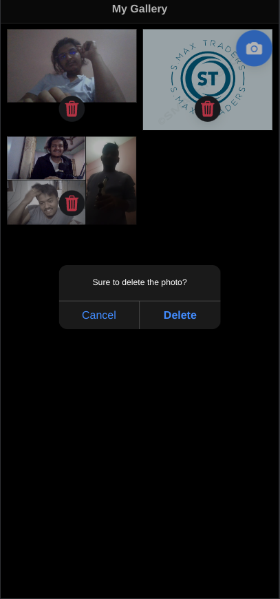

[](https://wakatime.com/badge/user/558bdd52-529b-4833-baae-cac62f99ff8a/project/018e5cdc-a376-499a-b597-cb1f1c66ece4)
# Ionic Camera Gallery

🌐 A fantastic cross-platform app built using ionic and capacitor that runs seamlessly on the web, Android, and iOS.
User can select photos from gallery or capture photos, and add them to the app.
This was hobby project, to understand the concept of ionic and capacitor.

## Features

- 🚀 Cross-platform compatibility
- 📱 Native performance on Android and iOS
- 🌐 Web support for a broader audience
- 🔄 Choose photos from the gallery and add to the app

## Screenshots
  <p align="center">
    
    
  </p>


## How to Install

```bash
# Clone the repository
git clone https://github.com/Bibker/ionic-camera-gallery.git

# Navigate to the project folder
cd ionic-camera-gallery

# Install dependencies
npm install